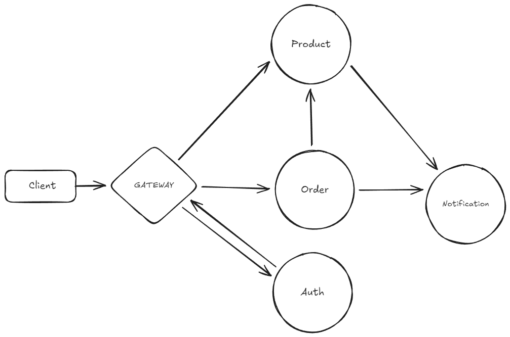

# Orderly e-commerce microservices

⚠️ Disclaimer: This project is for educational purposes only and should not be used in production.

## Architecture overview



## How to run the app?

Install dependecies first:

```sh
npm install
```

For order, product and auth services run

```sh
npx prisma migrate dev --name init
npx prisma generate
```

Install docker desktop and setup kafka and zookeper in docker desktop.

```sh
docker network create kafka-net
```

```sh
docker run --name zookeeper --network kafka-net -p 2181:2181 wurstmeister/zookeeper
```

```sh
docker docker run --name --network kafka-net kafka-test -p 9092:9092 -d -e KAFKA_LISTENERS=PLAINTEXT://0.0.0.0:9092 -e KAFKA_ADVERTISED_LISTENERS=PLAINTEXT://localhost:9092 -e KAFKA_ZOOKEEPER_CONNECT=zookeeper:2181 wurstmeister/kafka
```

Then To run the dev server for your app, use:

```sh
npx nx run-many -t serve
```

##  Enviroment variables

Make sure you have these variables in a .env file on the root of the monorepo:

```sh
NODE_ENV=development
GATEWAY_PORT=4100
KAFKA_BROKERS=localhost:9092

JWT_SECRET=jwt-token-sercret
JWT_EXPIRES_IN=3600s
```

And on the order-service, auth-service, product-service you could have an .env file with a  specific `DATABASE_URL`.

## API test(Swagger)

To test the apis go to this endpoint `/doc` grab a jwt token from `/api/auth/signup` or `/api/login` and use swagger authorize functionality to access other protected endpoints.